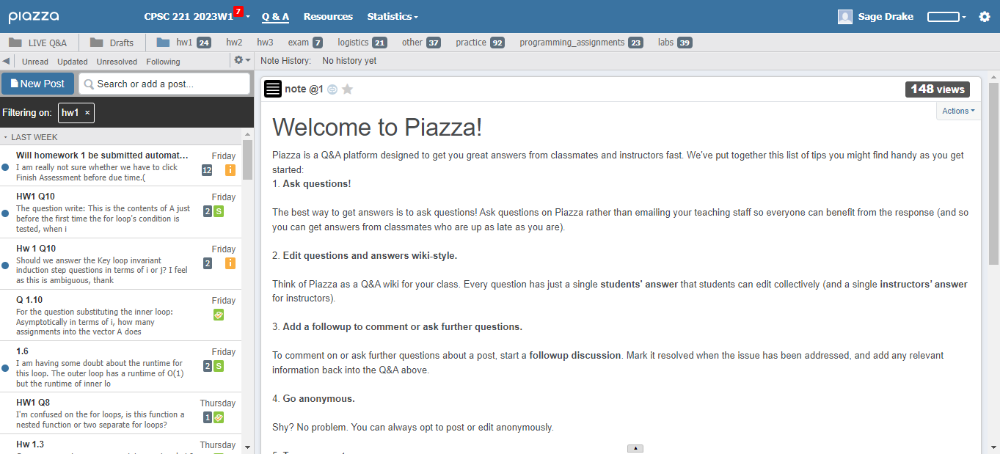
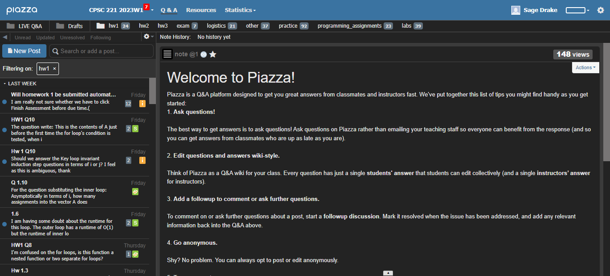

# Piazza Dark Mode

Piazza.com doesn't have a built-in dark mode feature, and I find the white background to be way too bright!
It used to discourage me from using the website, but I needed to use it for school. So, I decided to
create a Chrome Extension that solves the issue.

You can find the **Piazza Dark Mode Chrome** extension on the Chrome web store
[here](https://chrome.google.com/webstore/detail/piazza-dark-mode/ogocfhdkkiikncecdelajkgnhnbpcdfp).

## Features

The extension currently includes dark styling of all relevant elements in the Q&A, settings, and statistics pages. The background is different
shades of dark grey, and the text is off-white or light grey.

There's currently no popup window and Piazza will have a dark colour scheme as long as the extension is added to Chrome
and enabled.

**Without Piazza Dark Mode:**

**With Piazza Dark Mode:**

Coming soon...

- Dark styling of login page
- Toggle feature to switch between light and dark modes

## Credits

Here are some sources I used to help me in the development process:

- Chrome Developers Extensions Guide: https://developer.chrome.com/docs/extensions/mv3/
- CODE WITH ME: Build a Chrome Extension: https://www.youtube.com/watch?v=B8Ihv3xsWYs
- Chrome DevTools - Crash Course: https://www.youtube.com/watch?v=gTVpBbFWry8&t=769s
