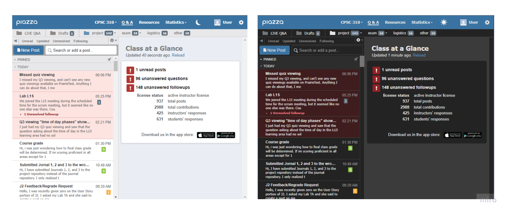
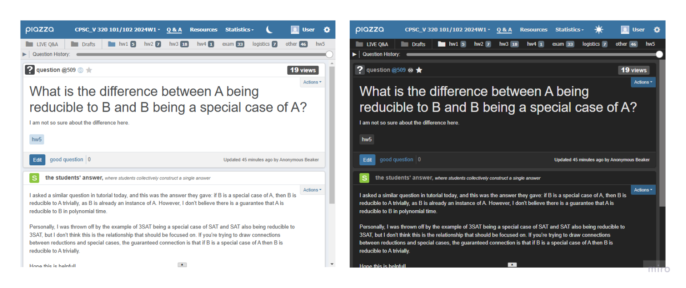
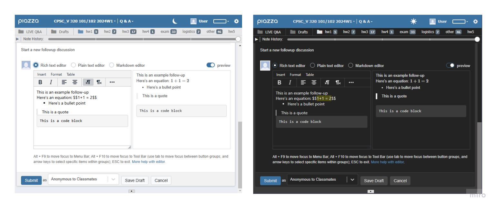

# Piazza Dark Mode

## Project Motivation
Piazza is a website for students to ask questions in a course-specific forum where instructors and students can answer. Many of the
courses I'm taking at UBC use this platform, and it does not have a built-in dark mode. The light colours of the website irritated me. 
So, I decided to create this Chrome extension to fix the issue.

## How to Use
### Easiest installation method
You can find the Piazza Dark Mode extension on the Chrome web store
[here](https://chrome.google.com/webstore/detail/piazza-dark-mode/ogocfhdkkiikncecdelajkgnhnbpcdfp). Click "Add to Chrome"
to start using the extension, and Piazza will default to dark mode the next time it is opened. 

### Alternate installation method
Another option is to clone this repo to get a local copy, and follow 
[these instructions](https://developer.chrome.com/docs/extensions/get-started/tutorial/hello-world#load-unpacked) to add the local copy
of the extension to Chrome. 

### Switching between light and dark mode

If you are missing the light mode experience of Piazza and want to switch back, click the sun icon in the top right corner:

Similarly, if you are in light mode and would like to switch back to dark mode, click the moon icon in the top right hand corner:

Your choice of light or dark mode will be remembered on future visits to Piazza pages.

## Dark Mode Results

Here are some examples of how Piazza Dark Mode changes the appearance of Piazza

## Future Improvements:
Currently, the extension only works well for student users of Piazza, not TAs or instructors. There are some UI elements that only instructors and TAs see, which the extension does not take into account. The reason I haven't added this is that I don't know if any instructors or TAs are even using the extension. 

## Technical Details:

**Technologies used:** CSS, JavaScript

The extension injects content scripts into pages with piazza.com URLs that match the patterns described in the manifest file. These content scripts are JavaScript
files that have access to the DOM of the web page. Some of these content scripts are common to a few Piazza pages, and others 
are only injected for a specific page on the website, such as the settings page.

There are three kinds of events that cause the extension to do something: 
1. **A Piazza page starts loading.** If the selected mode is dark mode, then relevant style elements are added to the page
so that dark CSS styles will be applied. The extension does not wait for the page to finish loading to apply these styles, 
since this would cause the page to appear light for a moment before darkening
2. **A Piazza page finished loading.** Once the page has finished loading, we can be confident that the menu bar at the top should exist.
So, at this point, the content script in charge of changing modes is injected. It adds a sun or moon icon
to the top bar, depending on whether the user's currently selected mode is light or dark mode.
3. **A user clicks the sun/moon icon to change modes.** If switching from light to dark mode, the relevant
style elements are added as children to the document. If switching from dark to light mode, the relevant style elements are removed. The new mode
selection is saved.

Other details:
- The mode selected by the user (light or dark mode) is stored using the Chrome storage API
- The "all_frames" option is used in the manifest to inject relevant
content scripts into documents that live inside iframes. This make sure students see white text when drafting a question 
or an answer in dark mode.

